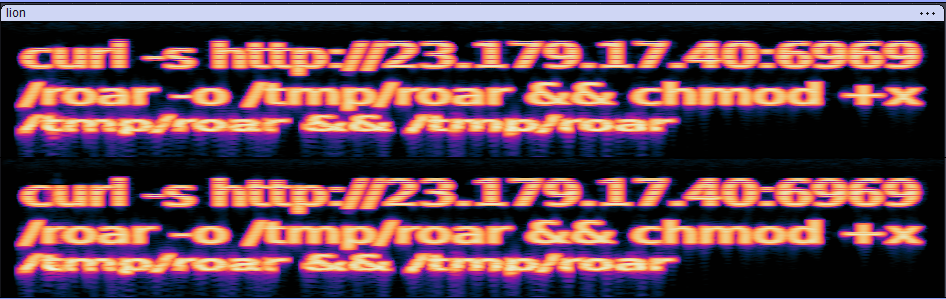
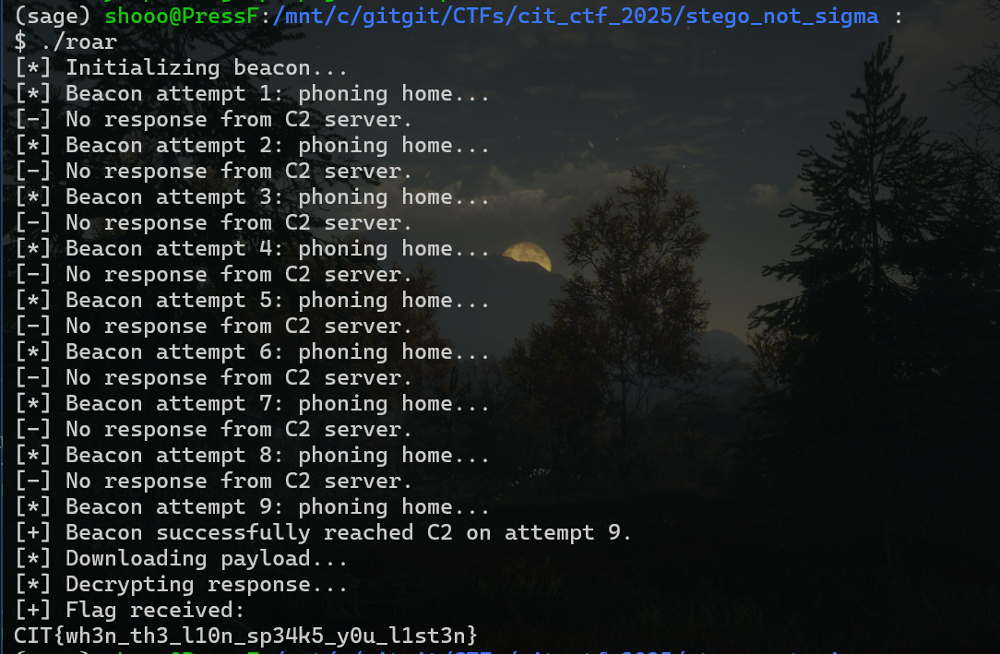

#  Sorry, you're NOT a sigma! 
You can do spetrograph on the mp4 and it will giv eyou a curl for a file

It'll give you a file which when you run as executable, it give you the flag!

## Flag
CIT{wh3n_th3_l10n_sp34k5_y0u_l1st3n}