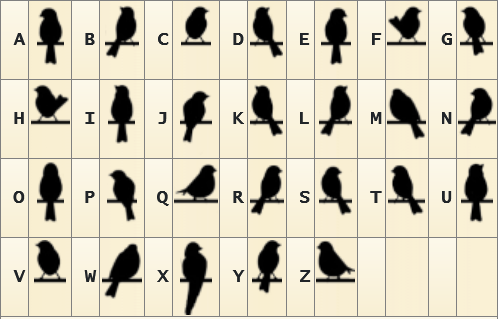

# The Birds
You think you're being watched, and you see a suspicious flock of birds on the powerlines outside of your house each morning. You think the feds are trying to tell you something. Separate words with underscores and encase in DawgCTF{}. All lowercase.

## Solution
This is birds on the wire cipher. Link: https://www.dcode.fr/birds-on-a-wire-cipher

## Flag
DawgCTF{THEREISNOESCAPE}