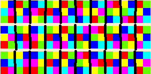

# Almighty Alphabet

You have this image:

Which is hexahue encoding. You can visit this site: https://www.geocachingtoolbox.com/index.php?lang=en&page=hexahue. 
Decrypt it into:
ofthecrame
rishexahue
joshfather

Rearrange it into: `thefatherofhexahueisjoshcramer` and you have the flag.

## Flag
jctfv{thefatherofhexahueisjoshcramer}